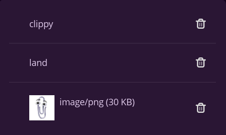

# clippy-land

COSMIC panel applet for keeping a history of recently copied text and images.

This applet polls the Wayland clipboard and updates the history when the contents change.




Main features:

- Keep a history of the latest **20** clipboard entries (text + images)
- Re-copy an entry with a single click
- Remove individual entries from the history

## Dependencies

- Wayland clipboard support (via `wl-clipboard-rs`)
- Build dependencies for libcosmic on Debian-based systems:
  - cargo
  - cmake
  - just
  - pkg-config
  - libxkbcommon-dev
  - libwayland-dev
  - libgl1-mesa-dev
  - libssl-dev
  - libexpat1-dev
  - libfontconfig-dev
  - libfreetype-dev

## Build

```bash
cargo build --release
```

## Build/Install with just

```bash
# build
just build

# install for current user
just install

# uninstall
just uninstall
```

## Usage

Open **COSMIC Settings → Desktop → Panel → Applets** and add “Clippy Land” to your panel.

## Notes

- App ID is currently `com.keewee.CosmicAppletClippyLand`
